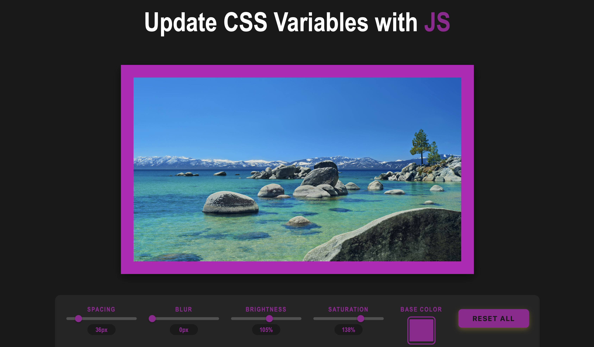
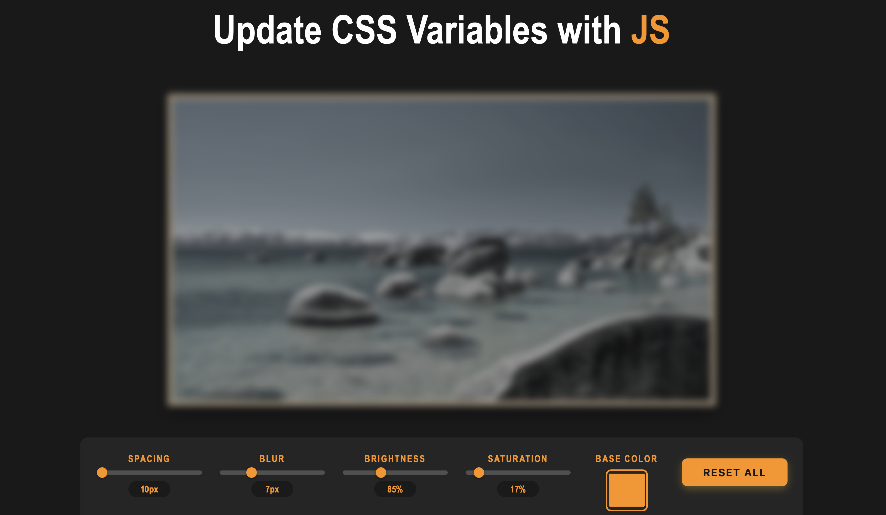

# Playing with CSS Variables and JS

## Descripción

Este es un reto interactivo que demuestra el poder de las variables CSS (Custom Properties) combinadas con JavaScript. Estas nos permite manipular en tiempo real propiedades visuales de una imagen mediante controles deslizantes y selectores de color, mostrando asi cómo JavaScript puede actualizar dinámicamente variables CSS para crear experiencias interactivas.

## Objetivo del Reto

Crear una interfaz interactiva que permita a los usuarios modificar propiedades CSS en una imagen en tiempo real utilizando controles HTML, demostrando la integración entre JavaScript y CSS Custom Properties para manipular estilos dinámicamente.

## Tecnologías Utilizadas

- **HTML5**: Estructura del documento y controles de entrada
- **CSS3**: Estilos y variables CSS (Custom Properties)
- **JavaScript (Vanilla)**: Lógica de interacción y manipulación del DOM
- **CSS Variables**: Variables nativas de CSS para control dinámico de estilos
- **CSS Filters**: Aplicación de efectos visuales (blur, brightness, saturate)

## Características

- **Spacing Control**: Ajusta el padding de la imagen (10-200px)
- **Blur Effect**: Aplica desenfoque a la imagen (0-25px)
- **Color Picker**: Cambia el color base del fondo y elementos destacados
- **Brightness Control**: Modifica el brillo de la imagen (50-150%)
- **Saturation Control**: Ajusta la saturación de colores (0-200%)
- **Reset Button**: Restaura todos los valores a sus configuraciones iniciales
- **Real-time Value Display**: Muestra el valor actual de cada control
- **Smooth Transitions**: Transiciones suaves entre cambios de estilo

## Captura de Pantalla






## Instrucciones de Instalación y Ejecución

### Opción 1: Ejecución Local Simple

1. **Clonar o descargar el repositorio**
   ```bash
   git clone [URL-de-este-repositorio]
   cd JSPractice
   ```

2. **Abrir el archivo HTML**
   - Simplemente abre `index.html` en tu navegador preferido
   - O usa la extensión Live Server de VS Code para una mejor experiencia

### Opción 2: Usar un servidor local

```bash
# Si tienes Python instalado:
python -m http.server 8000

# Si tienes Node.js con npx:
npx http-server

# Luego abre http://localhost:8000 en tu navegador
```

### Estructura de Archivos

```
JSPractice/
│
├── index.html          # Estructura HTML 
├── styles.css          # Estilos CSS
└── script.js           # Lógica JavaScript
```

## Despliegue

**Link al proyecto desplegado**: https://thedamnandres.github.io/JSPractice/


## Autor

**ANDRES JIMENEZ** 👹

